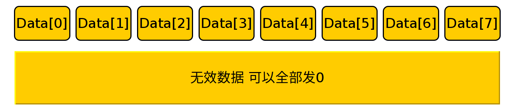

# WTR Serial2Motor

*author: Siqi Liang*

烧录进Robomaster A型开发板后 可通过对UART6发送信息从而让开发板朝电调发送CAN命令来控制电机

电机编号和类型：

指示灯：

## 串口错误指示灯

| 串口     | 位置        | 意义                       |
| -------- | ----------- | -------------------------- |
| 绿色常亮 | 图中左侧LED | 串口正常运行               |
| 红色常亮 | 图中左侧LED | 串口未初始化或数据校验失败 |

## 电机指示灯

| LED颜色  | 位置                          | 意义                               |
| -------- | ----------------------------- | ---------------------------------- |
| 常灭     | 右侧从上到下8个LED灯，编号0~7 | 电机未使能，无法运转               |
| 绿色常亮 | 右侧从上到下8个LED灯，编号0~7 | 电机已使能，可发送伺服命令使之运转 |

## 串口数据包组成

一个串口数据包由11个字节组成 分别是 包头2字节 控制命令2字节 串口数据8字节 具体意义如下

### 包头

一个串口数据包最前面的两个字节 恒定不变为0x55 0xaa 用于识别一个数据包的开始

### 控制命令

不同的控制命令对应不同功能，传输的串口数据也不同

### 串口数据

实际发送的数据，具体意义由控制命令决定

## 控制命令及串口数据

### cmdID: 0x5a

**注意，当红灯亮起时必须使用该命令恢复串口功能否则无法控制电机，串口指示灯为绿色时无需使用该命令**

使能或恢复串口，需要连续发送两个一模一样的该数据包来使能串口 

成功使能后**串口错误指示灯红灯会熄灭，绿色指示灯会亮起**

### cmdID: 0x01

使能电机 成功使能后对应电机编号的绿色led灯会亮 电机默认模式为速度伺服

### cmdID: 0x02

选择电机模式 将电机在位置伺服和速度伺服两种模式之间切换

### cmdID: 0x10+ID(0~7)

发送伺服指令  **数据类型四字节Float** 需要拆分成四字节uint8_t发送 数值表示电机位置伺服角度或速度伺服速度RPM(每分钟转速)

## 反馈数据

数据包长度 34字节

反馈频率20HZ

由包头（2字节）和数据部分（34字节组成）

包头固定为 **0xff 0x6a**

数据部分

后16字节表示0~7号电机位置角度值，表示方法同速度反馈

(高八位和第八位组成int16_t为实际数值)